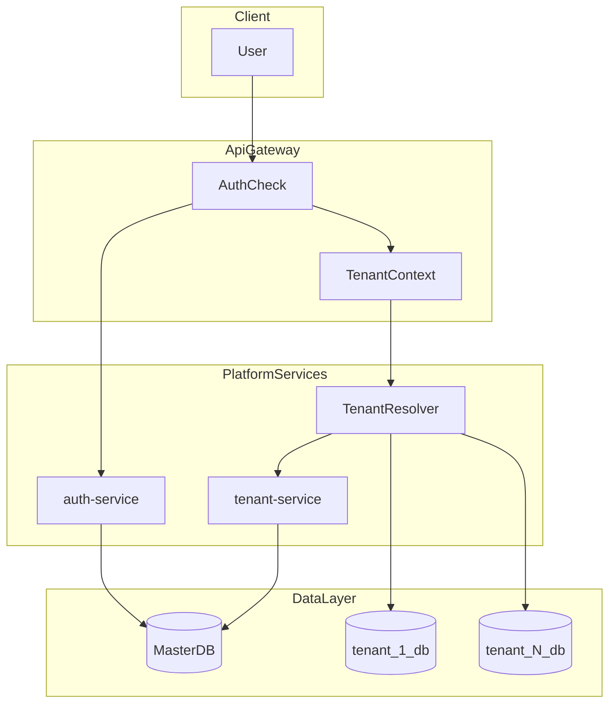
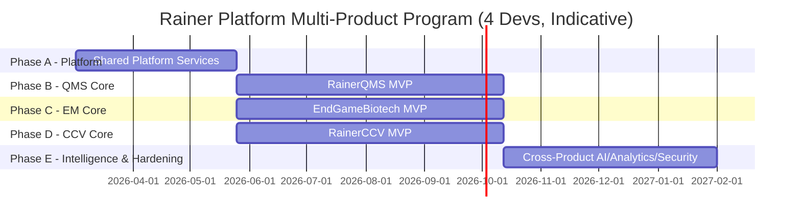

### 1. Executive Summary

This document defines a unified **implementation plan, architecture, and timeline** for:

- `RainerQMS` – lab QMS platform  
- `EndGameBiotech` – EM + AI plate analytics platform  
- `RainerCCV` – Certification, Calibration & Validation operations platform

All three are treated as **one program** built on a shared **Rainer Platform** (auth, tenancy, audit, workflow, notifications, reporting, analytics). Services and modules that appear across multiple products are built **once** and reused, significantly reducing total development time.

We provide:

- **High-Level Design (HLD)** – system architecture, product boundaries, shared vs domain services  
- **Low-Level Design (LLD) approach** – per-service patterns, engines (workflow, scheduling, reporting)  
- **Timelines** for:
  - **Single developer** using heavy AI assistance (Cursor, Windsurf, Claude Opus 4.6, Claude Sonnet 4.5)  
  - **4‑developer team** using the same tooling  
- **Phase, module, and sprint-wise clarity** for the combined program

---

### 2. Consolidated Scope & Shared Services

#### 2.1 Products & Domains

- **RainerQMS**
  - Document control, quality events, CAPA, audit, training, equipment, supplier, risk, complaints, management review, lab analytics/AI.
- **EndGameBiotech**
  - EM plates, image capture & processing, AI colony detection, QA review, EM reporting & analytics.
- **RainerCCV**
  - CRM, contracts/renewals, assets, scheduling/dispatch, technician management, field execution (mobile), reports & certificates, compliance, billing, customer portal.

#### 2.2 Shared “Rainer Platform” Services (Build Once, Reuse Everywhere)

These are common across all three products and should be implemented as shared microservices:

- **Identity & Tenancy**
  - `auth-service` – authentication, JWT, refresh tokens, MFA, **access keys** for internal/service APIs; uses the Master DB for `platform_users` and issues tokens that include tenant context.
  - `tenant-service` – owns the Master DB `tenants` and `tenant_settings` tables, tenant provisioning and lifecycle, branding, product enablement, plan/tier, per-tenant configuration, and the **tenant-resolver** logic for deriving tenant DB credentials.
  - `user-service` / `user-admin-service` – user profiles, role assignments, RBAC policy store (per-tenant and platform-wide, depending on role).

- **Governance & Compliance**
  - `audit-service` – immutable audit trail (create/update/delete, approvals, e-signatures, login events).
  - `notification-service` – email (Phase A), SMS/push/webhooks (Phase E); templates, preferences, escalation rules.
  - `workflow-engine` – generic state machines for approvals & flows (SOP approvals, CAPA workflows, QMS audits, EM QA decisions, CCV report approvals).
  - `config-service` – cross-product configuration (locations, facility hierarchy, media types, regulatory frameworks, enums).

- **Data, Documents & Intelligence**
  - `file-service` – S3/GCS storage, versioning, virus scans, access control.
  - `reporting-service` – report templates, data binding, PDF/CSV export, scheduled reports.
  - `analytics-service` – cross-module dashboards, KPIs, aggregates, time-series views.

- **Platform Edge & Infrastructure**
  - `gateway-service` – API gateway for routing, auth, rate limiting, tenant resolution, product scoping.
  - Observability stack – logging, metrics, tracing, alerting.
  - CI/CD, environment management – dev/stage/prod.

> **Key principle**: QMS, EM, and CCV are **domain packages** built on a common **platform substrate**.

#### 2.3 Domain Services (Per Product)

**RainerQMS**

- `document-service`, `quality-event-service`, `capa-service`
- `audit-domain-service` (on top of core `audit-service`)
- `training-service`, `equipment-service`
- `envmon-service`, `supplier-service`, `risk-service`
- `proficiency-testing-service`, `complaint-service`, `management-review-service`

**EndGameBiotech**

- `plate-service`, `image-service`
- `ai-service` (vision inference, pipelines)
- `job-service` (batch groupings)
- `qa-review-service` (on shared workflow engine)

**RainerCCV**

- `crm-service`, `contract-service`, `asset-service`
- `schedule-service`, `technician-service`, `workorder-service`
- `mobile-api-service` (mobile façade)
- `report-domain-service` (on top of `reporting-service`)
- `certificate-service`, `compliance-service`, `billing-service`, `portal-service`

---

### 3. High-Level Design (HLD)

#### 3.1 System Architecture Overview

```text
                     ┌───────────────────────┐
                     │      Web Frontend     │
                     │ (Next.js multi-app)   │
                     └───────────┬───────────┘
                                 │
                     ┌───────────┴───────────┐
                     │     API Gateway       │
                     │  (auth, tenant, RLS)  │
                     └───────────┬───────────┘
             ┌───────────────────┼───────────────────┐
             │                   │                   │
      ┌──────┴──────┐     ┌─────┴──────┐      ┌─────┴──────┐
      │Platform Svc │     │ QMS Domain │      │  EM Domain │
      │(auth, ... ) │     │ Services   │      │ Services   │
      └──────┬──────┘     └─────┬──────┘      └─────┬──────┘
             │                   │                   │
             │             ┌─────┴──────┐            │
             │             │ CCV Domain │            │
             │             │ Services   │            │
             │             └─────┬──────┘            │
             │                   │                   │
   ┌─────────┴──────────┐  ┌─────┴──────┐   ┌───────┴───────┐
   │ Postgres (Master + │  │ S3 / GCS   │   │ Message Bus    │
   │ Tenant DBs)        │  │ (files)    │   │ (events)       │
   └────────────────────┘  └────────────┘   └────────────────┘
```

- **Deployment**: Kubernetes (single cluster initially; logical namespaces per domain).
- **Tenancy**: **DB-per-tenant** with a central Master DB for metadata and auth; see 3.3 for details.
- **Eventing**: Kafka/RabbitMQ (or similar) for async flows (`certificate.issued`, `document.approved`, `workorder.completed`, etc.).
- **Security**:
  - JWTs (user sessions) + access keys (service-to-service).
  - Gateway enforces tenant context + coarse-grained RBAC.
  - Services enforce fine-grained authorization using shared RBAC library.

#### 3.2 Product Boundaries

- **QMS**: built primarily on workflow, training, audit, document, analytics.
- **EM (EndGame)**: built on file-storage + AI pipeline + QA workflow + analytics.
- **CCV**: built on scheduling, work orders, mobile, reporting, certificate, assets, billing.

Each product has:

- A **dedicated app shell** (`/app/qms`, `/app/em`, `/app/ccv`) in the same Next.js codebase.
- A **subset of shared services** + its own domain services.

#### 3.3 Data Architecture & Tenancy (DB-per-Tenant)

- **Master DB**: single logical database (or `master` schema) holding only **platform metadata and auth**:
  - `tenants` – routing and provisioning (id, tenant_name, db_name, db_user, status, created_at).
  - `platform_users` – central login and RBAC (id, email, password_hash, tenant_id, role, status, created_at).
  - `tenant_settings` – plan, features, limits per tenant.
  - `platform_audit_logs` – super-admin / platform-level logs (tenant_id, user_id, action, resource, ip_address, created_at).
  - `migrations_history` – master DB migration tracking.
- **Tenant DBs**: one **separate database per tenant** (e.g. `tenant_1_db`, `tenant_25_db`) created and owned by `tenant-service`:
  - Each tenant DB contains tenant-specific tables (users/roles/business tables, audit logs, etc.).
  - Database user and password are **derived**, not stored: `db_password = HMAC_SHA256(MASTER_SECRET, tenant_id)`.
- **Request path**:
  - Login: user authenticates via `auth-service` against `platform_users` in Master → JWT includes `tenant_id` (and optionally `db_name`).
  - Per-request: API Gateway validates JWT / API key, extracts tenant context, and passes it to a shared **Tenant Resolver** (library or sidecar) which:
    - Looks up `db_name` / `db_user` from Master (or cached config).
    - Derives the tenant DB password using the HMAC scheme.
    - Returns or selects a tenant-scoped connection / connection pool key.
  - Services that read/write tenant data use the tenant-scoped connection provided by the resolver.
- **Two-layer audit**:
  - Platform-level events (e.g. TENANT_CREATED, USER_LOGIN, PLAN_CHANGED) → `platform_audit_logs` in Master.
  - Domain events (e.g. DOCUMENT_APPROVED, WORKORDER_COMPLETED) → `audit_logs` table in each tenant DB; `audit-service` can aggregate or query across tenants when needed.

Conceptual flow:



#### 3.4 Infrastructure & Data Layer (Enterprise)

- **Postgres**:
  - Master DB + N tenant DBs on one or more Postgres instances.
  - Read replicas for reporting/analytics-heavy workloads.
  - Future: DB sharding and tenant grouping for very large tenant counts.
- **Redis**:
  - Caching (configuration, tenant routing metadata).
  - Session storage (if not fully stateless JWT).
  - Rate limiting and short-lived locks.
- **OpenSearch/Elasticsearch**:
  - Full-text search and cross-tenant search where allowed.
  - Centralized log aggregation and query for debugging/perf analysis.
- **Object Storage**:
  - S3/GCS/MinIO for files, images, reports, and certificates.
  - Versioning and lifecycle policies per product/module.
- **Message Bus**:
  - Kafka/RabbitMQ (or equivalent) for async domain events and background jobs.
  - Used by workflow engine, reporting, analytics, notification fan-out, etc.
- **Data Warehouse (Optional)**:
  - ClickHouse, BigQuery, or similar for long-term analytics and benchmarking.
  - Fed by events and/or ETL from tenant DBs (with anonymization/aggregation where needed).

---

### 4. Low-Level Design (LLD) Strategy

#### 4.1 Service Template

Every microservice follows a common pattern:

- `api/` – FastAPI/NestJS routers, OpenAPI spec
- `domain/` – entities, value objects, domain services (business logic)
- `infra/` – repositories, DB models, external clients (S3, queue)
- `events/` – event publishers/subscribers
- `tests/` – unit + integration tests

**Cross-cutting libraries**:

- `rainer-auth-lib` – JWT decode/verify, access key verification, current user/tenant helper.
- `rainer-audit-lib` – decorators/middleware to emit audit log records.
- `rainer-config-lib` – load/configure feature flags, per-tenant settings.
- `rainer-workflow-lib` – helper to define state machines using `workflow-engine`.

#### 4.2 Access Key–Based Internal Auth

- Each service has:
  - A **service account** in `auth-service`.
  - A long-lived **access key** (rotated) used to sign internal calls.
- Gateway and critical platform services:
  - **Validate** access keys on incoming internal requests.
  - Attach a trusted “service principal” identity for downstream checks.

#### 4.3 Shared Engines as Libraries + Services

- `workflow-engine`
  - Tables: `workflow_definitions`, `workflow_instances`, `workflow_steps`.
  - API: start workflow, transition state, query status.
  - QMS/CCV/EM define workflow definitions referencing their domain entities.

- `schedule-service`
  - Generic recurrence rules + schedule events.
  - QMS uses it for periodic reviews, trainings; CCV uses it for certification visits; EM may use for sampling schedules.

- `reporting-service`
  - Template engine (e.g. HTML-to-PDF).
  - Domain services submit a payload (`data + template_key`), receive back a file reference.

> LLD for each domain service references **these engines** rather than re-implementing per product.

#### 4.4 Tenant Resolver & Connection Management

- **Tenant Resolver**:
  - Core APIs:
    - `resolveTenant(tenantId) -> connectionConfigOrPoolKey`
    - `derivePassword(tenantId) -> derivedDbPassword` using `HMAC_SHA256(MASTER_SECRET, tenantId)`.
  - Used by any service that reads/writes tenant-scoped relational data.
- **Connection pooling**:
  - Maintain pools keyed by tenant DB and/or tenant ID to avoid recreating connections on every request.
  - Enforce global and per-tenant maximum connection limits to protect the database.
  - Expose metrics on pool usage, connection errors, and slow queries.
- **Folder structure alignment** (root):
  - `auth/`, `tenant/`, `migrations/`, `db/`, `services/`, `audit/` as top-level modules.
  - Within each service: `api/`, `domain/`, `infra/`, `events/`, `tests/`.

#### 4.5 Migrations

- **Master DB**:
  - Single migration history table; migrations run centrally (by tenant-service or CI/CD).
  - Contains schema for `tenants`, `platform_users`, `tenant_settings`, `platform_audit_logs`, `migrations_history`.
- **Tenant DBs**:
  - On tenant creation:
    - Run base schema migrations (e.g. `001_users.sql`, `002_roles.sql`, domain tables).
  - When platform-wide schema changes:
    - Enumerate all active tenants from Master.
    - For each tenant DB:
      - Connect using derived credentials.
      - Run pending migrations, tracked in a per-tenant `schema_migrations` table.
  - Automate migration runs and expose status dashboards to track success/failures.

#### 4.6 SLOs & Scaling

- **SLOs (examples)**:
  - Availability: 99.95% for gateway, auth-service, and tenant-service.
  - Latency: P95 < 200ms for typical read APIs and < 500ms for non-streaming writes on standard load.
  - Error budget policies defined per environment/tier.
- **Scaling patterns**:
  - Stateless services:
    - Horizontally scale using Kubernetes HPA based on CPU, memory, and custom metrics (requests/sec, queue depth).
  - Databases:
    - Read replicas for analytics and heavy read workloads.
    - Partition or time-slice high-volume tables (e.g. audit_logs) where necessary.
  - Heavy jobs:
    - Use queues and worker pools for report generation, AI inference, ETL tasks, etc.
    - Autoscale worker deployments independently of request-serving pods.

#### 4.7 Events

- **Topic naming**:
  - Use coherent, domain-oriented topics such as:
    - `auth.*`, `tenant.*`, `document.*`, `qualityevent.*`, `capa.*`, `plate.*`, `job.*`, `report.*`, `certificate.*`, `invoice.*`.
- **Payloads & versioning**:
  - Version event payloads via `version` fields or topic suffixes.
  - Publish compact JSON structures with IDs and essential fields; consumers fetch full records if needed.
  - Define and document retention and archival policies per topic (e.g. 7–30 days on the bus, long-term archive in warehouse).

#### 4.8 External API

- **Per-tenant API keys**:
  - Issued via tenant-service/auth-service for integration partners.
  - Include scopes (e.g. `read_only`, `reports`, `write`) and per-key rate limits.
  - Validated at the API gateway and logged to audit-service.
- **API design**:
  - REST as the primary external interface with OpenAPI documentation.
  - Optional gRPC for high-throughput internal calls between services that need low latency or streaming.

---

### 5. Timelines – Single Developer vs 4 Developers

All timelines assume:

- 2‑week sprints
- Heavy AI usage (Cursor, Windsurf, Claude Opus/Sonnet) to accelerate code, tests, and docs
- ~25–30% buffer for unknowns and refactors

#### 5.1 Overall Program Timelines

| Team | Platform (A) | QMS Core (B) | EM Core (C) | CCV Core (D) | Intelligence & Hardening (E) | Total Program |
| --- | --- | --- | --- | --- | --- | --- |
| **1 Developer** | 5–6 months | +7–8 months | +5–6 months | +5–6 months | +6–7 months | **~28–32 months** |
| **4 Developers** | 3 months | +4–5 months (parallel) | +4–5 months (parallel) | +4–5 months (parallel) | +3–4 months | **~14–18 months** |

> With 4 developers, B, C, and D run largely in parallel once platform A is stable enough, with shared UI/DevEx work spread across the team.
> With aggressive scope control and strong AI-assisted development, an initial GA target of **12–16 sprints (~6–8 months)** for a 4‑developer team is feasible, with 14–18 months as a conservative upper bound.

#### 5.2 Phase-Level Gantt (4-Developer Case)



For a **single developer**, the same phases run mostly sequentially:

- Phase A (platform): Sprints 1–12
- Phase B (QMS core): Sprints 13–28
- Phase C (EM core): Sprints 29–40
- Phase D (CCV core): Sprints 41–52
- Phase E (intelligence/hardening): Sprints 53–68

---

### 6. Integrated Phase & Sprint Plan (Condensed)

#### Phase A – Rainer Platform (Shared) – Sprints 1–12

- **Sprints 1–2**: Inception, combined service catalog, HLD/LLD standards.
- **Sprints 3–4**: `auth-service`, `tenant-service`, `user-service`, `gateway-service`.
- **Sprints 5–6**: `audit-service`, `notification-service`, `config-service`.
- **Sprints 7–8**: `workflow-engine`, `schedule-service`.
- **Sprints 9–10**: `file-service`, `reporting-service`.
- **Sprints 11–12**: `analytics-service`, observability, CI/CD polish.

#### Phase B – RainerQMS Core – Sprints 13–28

- **Sprints 13–16**: `document-service` (lifecycle, workflows, e-sign, periodic review).
- **Sprints 17–20**: `quality-event-service`, `capa-service` integrated with workflow, notifications.
- **Sprints 21–24**: `audit-domain-service`, `training-service`, `equipment-service`.
- **Sprints 25–28**: QMS dashboards via `analytics-service`, QMS MVP stabilization.

#### Phase C – EndGameBiotech Core – Sprints 17–30 (parallelizable)

- **Sprints 17–20**: `plate-service`, `image-service` on top of `file-service`.
- **Sprints 21–24**: `ai-service` v1 (inference, queue), `job-service`.
- **Sprints 25–28**: `qa-review-service` with shared workflow and reporting.
- **Sprints 29–30**: EM analytics/visualizations; AI observability.

#### Phase D – RainerCCV Core – Sprints 17–30 (parallelizable)

- **Sprints 17–20**: `crm-service`, `contract-service`, `asset-service`.
- **Sprints 21–24**: `schedule-service` integration, `technician-service`, `workorder-service`.
- **Sprints 25–28**: `mobile-api-service` + mobile app; `report-domain-service`, `certificate-service`.
- **Sprints 29–30**: `compliance-service`, `billing-service`, minimal `portal-service`.

#### Phase E – Intelligence & Hardening – Sprints 31–40

- **Sprints 31–34**: AI v2 for EM & QMS; extended `analytics-service` dashboards for all products.
- **Sprints 35–38**: Security, performance, data retention, validation documentation across the stack.
- **Sprints 39–40**: Final GA polish, unified onboarding & operational toolkit.

---

### 7. AI-Assisted Development Approach

- **Design (HLD/LLD)**
  - Use Claude Opus 4.6/Sonnet 4.5 in Cursor/Windsurf to:
    - Review and iterate architecture diagrams and service boundaries.
    - Propose alternative schema designs and workflow definitions.

- **Implementation**
  - Use Cursor/Windsurf with AI for:
    - Generating service skeletons from a common template.
    - Writing boilerplate controllers, DTOs, migrations, and tests.
    - Refactoring duplicated logic into shared libraries.

- **Documentation & Validation**
  - Keep architecture docs, ADRs, and sequence diagrams continuously updated via AI prompts.
  - Generate validation summaries, runbooks, and onboarding documentation from code and test suites.

> AI tools are used as **force multipliers**, not as a separate phase. The timelines above already assume consistent AI usage.

For AI capabilities themselves:

- Keep **AI domain-specific**:
  - EndGameBiotech uses its own `ai-service` for plate image analysis and annotation.
  - QMS and CCV may add focused AI features (e.g. exam generation, document summarization, root-cause suggestions) through their own domain services.
- Apply **shared guardrails**:
  - All AI outputs used in regulated/compliance contexts must pass through human-in-the-loop review.
  - Log model usage, prompts (where allowed), and decisions to `audit-service` for traceability.
  - Use Claude Opus 4.6 for long-form/high-context tasks and Claude Sonnet 4.5 for faster, lower-latency tasks, guided by internal runbooks rather than a central AI orchestrator service.

---

### 8. How to Use This Document

- As a **master program plan** for all three products:
  - RainerQMS, EndGameBiotech, and RainerCCV share one platform and roadmap.
- As a **scoping and hiring guide**:
  - Use the single‑dev vs 4‑dev timelines to decide when to expand the team.
  - Allocate services by engineer (platform, QMS, EM, CCV) while keeping shared standards.
- As a **HLD/LLD anchor**:
  - Extend this document with more detailed LLD per service as you start implementation.
  - Keep the service catalog and timelines updated as requirements evolve.

---

### 9. Risks & Mitigations

- **Single-developer bottleneck and context switching**
  - Mitigation:
    - Invest early in platform foundations (auth, tenant, gateway, tenant-resolver).
    - Build small, demonstrable vertical slices for each product early to validate architecture.
    - Keep a clear, prioritized backlog and limit work-in-progress.
- **AI in regulated outputs**
  - Mitigation:
    - Enforce human-in-the-loop review for any AI-generated content used in compliance decisions.
    - Audit all AI calls and decisions via `audit-service`.
    - Maintain clear documentation of intended use, limitations, and validation status of AI features.
- **Multi-tenant isolation and data security**
  - Mitigation:
    - Use DB-per-tenant with derived credentials and least-privilege per-tenant DB users.
    - Perform security reviews early (schema, connection handling, tenant resolution).
    - Add automated tests and checks for cross-tenant access violations.
- **Tenant DB operational load (migrations, connections, backups)**
  - Mitigation:
    - Build automated migration runners and dashboards for tenant DB migration status.
    - Introduce connection pooling with sensible per-tenant and global limits.
    - Plan for sharding and tenant grouping once tenant counts or data volumes justify it.
- **External model/API limits and AI cost**
  - Mitigation:
    - Cache AI results when appropriate; batch requests where possible.
    - Use cheaper/faster models for non-critical flows; reserve Opus for heavy tasks.
    - Monitor cost and latency; tune prompts and usage patterns over time.

---

### 10. Quick Wins (Sprints 1–2)

- **auth-service + api-gateway + service template**
  - Implement `auth-service` backed by the Master DB `platform_users` table (login, JWT issuance/validation, optional MFA).
  - Implement `gateway-service` with routing, auth checks, and injection of tenant context into downstream requests.
  - Create a **service template** (repo scaffolding) that includes:
    - Standard folders (`api/`, `domain/`, `infra/`, `events/`, `tests/`).
    - Common middleware (logging, metrics, error handling).
    - CI pipeline config and Dockerfile.
- **tenant-service skeleton + tenant resolver**
  - Implement Master DB tables: `tenants`, `tenant_settings`, and initial `platform_audit_logs`.
  - Implement tenant creation flow (super-admin only):
    - Insert into Master DB.
    - Create tenant DB and tenant DB user using derived credentials.
    - Run base migrations on new tenant DB.
  - Implement a first version of the **tenant-resolver** library:
    - `resolveTenant(tenantId)` and `derivePassword(tenantId)`.
- **file-service + staging environment**
  - Implement `file-service` with S3-compatible storage and a staging bucket.
  - Expose basic upload/download APIs and integrate with gateway.
- **Contracts and schemas**
  - Define and publish initial OpenAPI specs for platform services.
  - Define initial event schemas for a small set of topics (e.g. `tenant.created`, `user.logged_in`).

---

### 11. To-Do List (Phase-wise Checklist)

- **Phase A — Platform**
  - Master DB schema: `tenants`, `platform_users`, `tenant_settings`, `platform_audit_logs`, `migrations_history`.
  - `auth-service`: login, JWT, MFA (where applicable), access keys for internal services.
  - `tenant-service`: CRUD tenants, tenant creation flow, derived credentials, tenant-resolver, tenant DB migrations.
  - `gateway-service`: routing, auth, tenant resolution, rate limiting, basic observability hooks.
  - `user-service`: RBAC and roles, reading from Master and/or tenant DBs as designed.
  - `audit-service`: append-only logging; platform events → Master, domain events → tenant audit_logs.
  - `notification-service`, `config-service`, `workflow-engine`, `schedule-service`, `file-service`, `reporting-service`, `analytics-service`.
  - CI/CD pipelines and observability stack (logs, metrics, traces); Redis and OpenSearch if in scope for early phases.
- **Phase B — RainerQMS**
  - `document-service`, `quality-event-service`, `capa-service`, `training-service`, `equipment-service`, and other QMS modules, all using tenant-resolver and tenant DBs.
  - QMS vertical slice E2E: document create → approval workflow → training assignment → audit entries.
- **Phase C — EndGameBiotech**
  - `plate-service`, `image-service`, `ai-service` (domain), `job-service`, `qa-review-service`.
  - EM vertical slice E2E: plate capture/upload → AI analysis → QA review → EM report generation.
- **Phase D — RainerCCV**
  - `crm-service`, `contract-service`, `asset-service`, `schedule-service`, `workorder-service`, `certificate-service`, `billing-service`, `portal-service`.
  - CCV vertical slice E2E: lead/contract → recurring schedule → work order execution → report & certificate → invoice.
- **Phase E — Hardening & Scale**
  - SLO monitoring dashboards and alerting.
  - Security review and remediation for auth, tenancy, and data access.
  - Performance tuning and capacity planning.
  - Validation docs (IQ/OQ/PQ where required), tenant migration runbooks.
  - Optional data warehouse integration and advanced scaling patterns (sharding, read replicas, partitioning).

---

### 12. Single-Developer and 4-Developer Execution (Refined)

- **Single developer**
  - Keep Phase A→E and the sprint ranges described earlier (e.g. Phase A Sprints 1–12, Phase B Sprints 13–28, etc.).
  - Within late Phase A or early Phase B, plan **one vertical slice per product** using real tenant DBs and the tenant-resolver:
    - QMS: document creation → approval → training assignment.
    - EM: plate capture/upload → AI analysis → QA review → report.
    - CCV: contract → scheduled visit → work order execution → certificate.
  - Use these slices (2–4 sprints) to validate the architecture, tenancy, and operational processes before scaling breadth.
  - With strict scope and effective AI use, a **20–24 month** target is possible; **28–32 months** remains a conservative baseline.
- **4 developers**
  - **Role allocation**:
    - Dev A — Platform: auth, tenant, gateway, tenant-resolver, audit, file, CI/CD, observability.
    - Dev B — QMS: all QMS domain services and QMS-specific UI.
    - Dev C — EM: plate/image/AI/job/QA review, EM-specific UI.
    - Dev D — CCV: CRM/contract/schedule/workorder/billing/portal, plus integrations.
  - **Timeline**:
    - Target **12–16 sprints (~6–8 months)** for core GA assuming strong parallelization and minimal scope creep.
    - Reserve the last 2–4 sprints for integration, hardening, and compliance/validation work across all products.
  - Provide a simple internal Gantt or ownership table describing which services are expected in which sprint for each developer.

